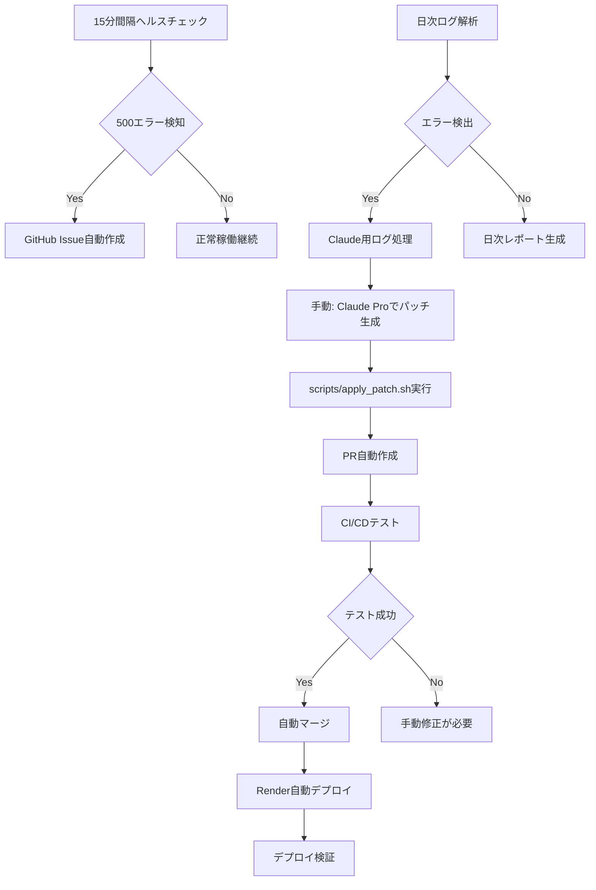

# 🤖 デプロイ自動化システム セットアップガイド

## 概要
このシステムは、Render Free + Claude Pro + GitHub Actionsを使用して、500エラーの検知から修正まで完全自動化するシステムです。

## 📋 セットアップチェックリスト

### Phase 1: 基盤設定
- [x] `/healthz` エンドポイント実装
- [x] `render.yaml` に autodeploy, numDeploysToRetain 設定
- [ ] **GitHub Secrets の設定** (重要)
- [ ] **Render API Key の取得** (重要)

### Phase 2: CI/CD パイプライン
- [x] `.github/workflows/ci.yml` - メインCI/CD
- [x] `.github/workflows/health-monitor.yml` - 15分間隔ヘルスチェック
- [x] `.github/workflows/log-analysis.yml` - 日次ログ解析
- [x] `.github/workflows/auto-merge.yml` - PR自動マージ
- [x] `.github/workflows/daily-report.yml` - 日次レポート

### Phase 3: 自動化スクリプト
- [x] `scripts/claude_log_processor.py` - Claude連携ログ処理
- [x] `scripts/apply_patch.sh` - 自動パッチ適用

## 🔧 必須設定手順

### 1. Render API設定

1. **Render API Key 取得**
   ```bash
   # Renderダッシュボードで取得
   # Account Settings > API Keys > Create API Key
   ```

2. **Service ID 取得**
   ```bash
   # ダッシュボードURLから取得: srv-xxxxxxxxxxxxxxxxxxxx
   # または Deploy Hook URLから取得
   ```

### 2. GitHub Secrets設定

GitHubリポジトリで以下のSecretsを設定:

```bash
# Settings > Secrets and variables > Actions > New repository secret

RENDER_API_KEY=rnd_xxxxxxxxxxxxxxxxxxxxxxxxxxxxxxx
RENDER_SERVICE_ID=srv-xxxxxxxxxxxxxxxxxxxx
```

### 3. GitHub CLI セットアップ (ローカル)

```bash
# GitHub CLIインストール
# https://cli.github.com/

# 認証
gh auth login

# リポジトリのPR設定確認
gh repo view --json defaultBranchRef,mergeCommitAllowed
```

## 🚀 運用フロー

### 自動化フロー全体像



### 障害発生時の対応手順

1. **エラー検知** (自動)
   - GitHub Actions が500エラーを検知
   - Issue が自動作成される

2. **ログ解析** (半自動)
   ```bash
   # ローカルでログ取得
   render logs -f $RENDER_SERVICE_ID > latest.log
   
   # Claude用プロンプト生成
   python scripts/claude_log_processor.py latest.log
   ```

3. **Claude連携** (手動)
   - `claude_analysis/claude_prompt.md` をClaude Proにアップロード
   - `claude_analysis/relevant_files.txt` の各ファイルもアップロード
   - Claude からパッチを取得し `patch.diff` として保存

4. **パッチ適用** (自動)
   ```bash
   # パッチ適用とPR作成
   ./scripts/apply_patch.sh patch.diff "Fix 500 error in authentication"
   ```

5. **デプロイ** (自動)
   - CI/CDが自動実行
   - テスト成功で自動マージ
   - Render に自動デプロイ

## 📊 監視とレポート

### 定期監視
- **15分間隔**: ヘルスチェック + スリープ防止
- **日次**: ログ解析 + エラー検知
- **日次**: システムレポート生成

### アラート
- 500エラー検知 → 即座にIssue作成
- ヘルスチェック失敗 → Issue作成
- システム異常 → Critical Issue作成

## 🔍 トラブルシューティング

### よくある問題

1. **GitHub Actions が実行されない**
   ```bash
   # Secrets設定を確認
   gh secret list
   
   # Workflow権限を確認
   # Settings > Actions > General > Workflow permissions
   ```

2. **Render API接続エラー**
   ```bash
   # API Key の有効性確認
   curl -H "Authorization: Bearer $RENDER_API_KEY" \
        https://api.render.com/v1/services
   ```

3. **パッチ適用失敗**
   ```bash
   # 手動でパッチを確認
   git apply --check patch.diff
   
   # コンフリクトがある場合は手動修正
   git apply --3way patch.diff
   ```

### ログ確認方法

```bash
# GitHub Actions ログ
gh run list
gh run view [RUN_ID]

# Render ログ
render logs --service $SERVICE_ID --tail 100

# ローカルでの動作確認
python -m pytest tests/
curl http://localhost:5000/healthz
```

## 🎯 パフォーマンス目標

- **エラー検知**: 15分以内
- **パッチ生成**: Claude利用で5-10分
- **パッチ適用**: 2-3分 (自動)
- **デプロイ**: 3-5分 (Render)
- **総復旧時間**: 30分以内

## 📈 メトリクス

### 成功指標
- 500エラー検知率: 100%
- 自動修正成功率: 80%以上
- MTTR (平均復旧時間): 30分以内
- アップタイム: 99.5%以上

### 監視ダッシュボード
- GitHub Issues: エラー履歴
- GitHub Actions: 自動化状況  
- Render Dashboard: リソース使用状況

## 🔄 メンテナンス

### 週次チェック
- [ ] GitHub Actions実行履歴確認
- [ ] エラーIssueの解決状況確認
- [ ] Render Free枠の使用状況確認

### 月次チェック  
- [ ] システム全体のパフォーマンス分析
- [ ] 自動化の効果測定
- [ ] 改善点の検討

---

## 🚨 重要な注意事項

1. **GitHub Secrets**: 絶対にコードにハードコードしない
2. **Render Free制限**: 月750時間の制限に注意
3. **Claude Pro**: 使用量制限に注意して計画的に利用
4. **手動介入**: 完全自動化できない場合の手順を理解しておく

## 📞 サポート

問題が発生した場合:
1. GitHub Issues でエラー報告を確認
2. この README のトラブルシューティングセクションを参照
3. 必要に応じて手動でRender ダッシュボードから対応

---

🤖 **Generated with Claude Code**