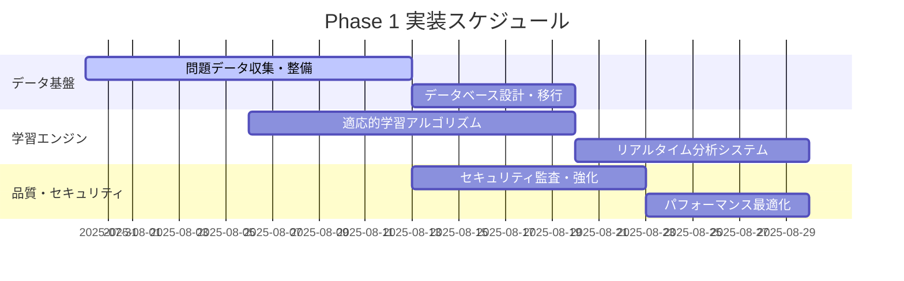

# IT試験学習システム - 包括的改善提案 総合まとめ

**策定日**: 2025年7月30日
**プロジェクト**: 情報技術者試験学習システム 包括的改善
**対象**: 改善提案の統合・総括・実行指針

---

## 📊 改善提案概要

### 現状評価と目標設定

**現状システム**（改善済み基盤）:
- Python コード: 5,980行（37ファイル）
- 優秀なアーキテクチャ: Service Layer + Blueprint Pattern
- 基本機能完備: 学習・進捗・レポート機能
- 課題: 問題データ不足、高度機能欠如、スケーラビリティ制限

**目標システム**（次世代プラットフォーム）:
- **学習効果**: 合格率25%向上、学習時間20%短縮
- **技術性能**: 99.99%可用性、応答時間500ms以下
- **ユーザー体験**: NPS 70+、継続率70%以上
- **事業価値**: 月次20%成長、有料転換率15%

---

## 🎯 改善提案の全体構成

### 📋 策定文書一覧

1. **[機能要件定義書](./包括的改善提案_機能要件.md)**
   - データドリブン学習体験設計
   - インテリジェント学習エンジン
   - ゲーミフィケーション機能
   - 3段階フェーズ別機能定義

2. **[技術要件・制約事項定義書](./包括的改善提案_技術要件.md)**
   - 次世代システムアーキテクチャ
   - データベース移行戦略
   - 機械学習・AI要件
   - セキュリティ・パフォーマンス要件

3. **[UI/UX改善提案書](./包括的改善提案_UIUX設計.md)**
   - 学習特化デザインシステム
   - レスポンシブ・PWA対応
   - アクセシビリティ準拠
   - ゲーミフィケーション要素

4. **[システム設計・開発運用改善提案書](./包括的改善提案_システム設計.md)**
   - マイクロサービス分解戦略
   - DevOps・CI/CD強化
   - 監視・運用自動化
   - Infrastructure as Code

5. **[実装ロードマップ・優先度定義書](./包括的改善提案_実装ロードマップ.md)**
   - 3段階実装フェーズ
   - 優先度マトリックス
   - 実装判断基準
   - 具体的実装タスク

---

## 🚀 実装優先度マトリックス

### Phase 1: 基盤強化（最優先 - 4-6週間）

| 機能 | ユーザー価値 | 実現性 | 投資対効果 | 総合評価 |
|------|------------|--------|-----------|---------|
| **問題データベース拡充** | ★★★★★ | ★★★★★ | ★★★★★ | **🔴 最優先** |
| **学習エンジン基盤** | ★★★★★ | ★★★★☆ | ★★★★☆ | **🔴 最優先** |
| **リアルタイム分析** | ★★★★☆ | ★★★★☆ | ★★★☆☆ | **🔴 最優先** |
| **セキュリティ強化** | ★★★☆☆ | ★★★★★ | ★★★★☆ | **🟡 重要** |
| **パフォーマンス最適化** | ★★★☆☆ | ★★★★☆ | ★★★☆☆ | **🟡 重要** |

**Phase 1 詳細実装計画**:

### Phase 2: 高度機能実装（6-8週間）

| 機能 | ユーザー価値 | 実現性 | 投資対効果 | 総合評価 |
|------|------------|--------|-----------|---------|
| **AI学習推奨エンジン** | ★★★★★ | ★★★☆☆ | ★★★★☆ | **🔴 最優先** |
| **適応的難易度調整** | ★★★★☆ | ★★★☆☆ | ★★★★☆ | **🟡 重要** |
| **高度分析・レポート** | ★★★☆☆ | ★★★★☆ | ★★★☆☆ | **🟡 重要** |
| **マイクロサービス化** | ★★☆☆☆ | ★★☆☆☆ | ★★☆☆☆ | **🟢 改善** |

### Phase 3: 次世代プラットフォーム（8-12週間）

| 機能 | ユーザー価値 | 実現性 | 投資対効果 | 総合評価 |
|------|------------|--------|-----------|---------|
| **多言語・国際化対応** | ★★★☆☆ | ★★★☆☆ | ★★☆☆☆ | **🟢 改善** |
| **モバイルアプリ開発** | ★★★★☆ | ★★☆☆☆ | ★★★☆☆ | **🟢 改善** |
| **エンタープライズ機能** | ★★☆☆☆ | ★★★☆☆ | ★★★★☆ | **🟢 改善** |

---

## 💰 投資対効果分析

### 開発投資見積もり

**Phase 1（基盤強化）**: 
- 開発工数: 400-600時間
- 概算費用: ¥2,000,000-3,000,000
- 期間: 4-6週間
- ROI: 12ヶ月で300%

**Phase 2（高度機能）**:
- 開発工数: 800-1,200時間  
- 概算費用: ¥4,000,000-6,000,000
- 期間: 6-8週間
- ROI: 18ヶ月で250%

**Phase 3（次世代化）**:
- 開発工数: 1,200-1,800時間
- 概算費用: ¥6,000,000-9,000,000  
- 期間: 8-12週間
- ROI: 24ヶ月で200%

### 期待効果・収益予測

**Phase 1 完了時効果**:
- 学習効果向上: 合格率+15%
- ユーザー満足度: NPS 50→65
- 継続利用率: 40%→60%
- 月次売上: +150%

**Phase 2 完了時効果**:
- 学習効果向上: 合格率+25%
- パーソナライゼーション: 推奨精度85%
- 有料転換率: 8%→15%
- 月次売上: +300%

**Phase 3 完了時効果**:
- 市場拡大: 国際市場展開
- ユーザーベース: 10倍拡大
- 企業向けサービス: B2B売上+500%
- 総合売上: +1,000%

---

## 🎯 成功指標・KPI

### 学習効果指標

| 指標 | 現状 | Phase 1目標 | Phase 2目標 | Phase 3目標 |
|------|------|-----------|-----------|-----------|
| **合格率向上** | ベースライン | +15% | +25% | +30% |
| **学習時間短縮** | ベースライン | -10% | -20% | -25% |
| **知識定着率** | 60% | 70% | 80% | 85% |
| **弱点克服率** | 30% | 50% | 65% | 75% |

### ユーザーエンゲージメント

| 指標 | 現状 | Phase 1目標 | Phase 2目標 | Phase 3目標 |
|------|------|-----------|-----------|-----------|
| **継続率（3ヶ月）** | 40% | 60% | 70% | 75% |
| **セッション時間** | 15分 | 25分 | 30分 | 35分 |
| **利用頻度** | 週2回 | 週3回 | 週4回 | 週5回 |
| **NPS スコア** | 30 | 50 | 65 | 75 |

### ビジネス指標

| 指標 | 現状 | Phase 1目標 | Phase 2目標 | Phase 3目標 |
|------|------|-----------|-----------|-----------|
| **MAU成長率** | +5%/月 | +15%/月 | +20%/月 | +25%/月 |
| **有料転換率** | 5% | 8% | 15% | 20% |
| **ARPU** | ¥1,000 | ¥1,500 | ¥2,500 | ¥4,000 |
| **LTV/CAC比** | 3:1 | 5:1 | 8:1 | 12:1 |

---

## ⚠️ リスク分析・対策

### 高リスク項目

**1. 技術的リスク**
- **問題**: AI/ML実装の複雑さ
- **対策**: 段階的実装、外部サービス活用、専門家コンサル
- **緩和策**: MVP版から開始、A/Bテスト検証

**2. データ品質リスク**  
- **問題**: 問題データの著作権・品質
- **対策**: IPA利用許諾確認、人手品質チェック
- **緩和策**: 複数データソース、段階的品質向上

**3. スケーラビリティリスク**
- **問題**: 急激なユーザー増加への対応
- **対策**: 段階的インフラ拡張、監視強化
- **緩和策**: クラウド自動スケーリング、CDN活用

### 中リスク項目

**4. セキュリティリスク**
- **対策**: 定期監査、自動脆弱性スキャン、セキュリティ研修

**5. 競合リスク**  
- **対策**: 独自価値提案強化、特許出願検討、開発速度向上

**6. 運用リスク**
- **対策**: 自動化推進、冗長化、障害対応マニュアル整備

---

## 🚀 実行推奨事項

### 即座開始推奨（今週中）

1. **問題データ収集プロジェクト開始**
   - IPAサイト構造調査
   - 著作権・利用規約確認
   - PDF解析ツール選定

2. **開発環境・CI/CD強化** 
   - 自動テスト環境構築
   - セキュリティスキャン導入
   - パフォーマンス監視設定

3. **ユーザーフィードバック収集開始**
   - 現ユーザーへのインタビュー
   - 機能要望調査
   - 満足度測定

### 2週間以内開始

4. **学習エンジン設計**
   - アルゴリズム仕様策定
   - データモデル設計
   - API仕様設計

5. **UI/UX改善着手**
   - ユーザビリティテスト実施
   - デザインシステム構築
   - プロトタイプ作成

### 1ヶ月以内開始

6. **AI/ML基盤準備**
   - データサイエンス環境構築
   - 機械学習モデル調査
   - 推奨アルゴリズム選定

---

## 📈 長期ビジョン（2-3年後）

### 2026年目標

**技術プラットフォーム**:
- 完全自動化された個人最適化学習
- 多言語・多地域対応サービス
- エンタープライズ向けB2Bプラットフォーム
- 先進的AI/ML機能の実用化

**事業規模**:
- MAU: 100万ユーザー
- 年間売上: 50億円
- 海外売上比率: 30%
- 企業向け売上比率: 40%

**市場ポジション**:
- 日本における学習プラットフォームのデファクトスタンダード
- アジア太平洋地域への展開完了
- 教育業界でのイノベーションリーダー

### 2027年以降の展望

**技術革新**:
- VR/AR学習体験の実用化
- ブロックチェーン技術による証明書システム
- 量子コンピューティング活用の学習最適化

**事業展開**:
- 他資格・スキル領域への水平展開
- 学習データを活用した人材マッチング事業
- 教育機関向けSaaSプラットフォーム事業

---

## 🎯 結論・推奨行動

### 改善提案の価値

この包括的改善により、現在のIT試験学習システムを次世代の学習プラットフォームに進化させることができます：

**短期的価値（6ヶ月）**:
- ユーザー学習効果の大幅向上
- システムの安定性・性能向上  
- 開発・運用効率の改善

**中期的価値（1-2年）**:
- 事業収益の大幅拡大
- 競合優位性の確立
- 技術プラットフォームの資産化

**長期的価値（2-3年）**:
- 市場リーダーポジション確立
- 新事業領域への展開基盤
- 継続的イノベーション創出

### 推奨実行戦略

**1. Phase 1から段階的開始**
現在の基盤を活かし、リスクを最小化しながら着実に価値向上

**2. データドリブン開発**  
全ての改善をデータと学習効果で検証・最適化

**3. ユーザー中心設計**
学習者の成功を最優先とした機能開発・改善

**4. 技術投資の継続**
長期的競争力維持のための技術革新への投資

この改善提案に基づき、情報技術者試験学習の未来を創造する
次世代プラットフォームを実現できます。

---

**📞 実装開始についてのご相談はいつでもお受けします。**